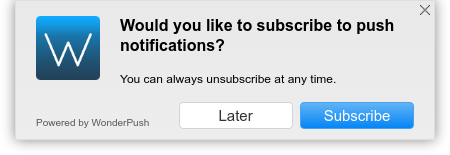

WonderPush Web Plugin Optin-Dialog
==================================

WonderPush Web SDK plugin to present the user an opt-in dialog before prompting her for push permission.

Here is a screenshot of the default dialog shown to the user if no option is given:

It appears centered on the top edge of the page and does not scroll with the page.
The actual icon that will be show is the one you configured in the WonderPush dashboard.

About WonderPush
----------------

[WonderPush](https://www.wonderpush.com/) is a push notifications
service that allows your users to opt-in to timely updates from your
website and allow you to effectively re-engage them with customized,
engaging content, even when they are not currently browsing your
website.

Find out how to integrate web push notifications to your website
easily at: https://www.wonderpush.com/docs/web/getting-started.

Plugin documentation
--------------------

The documentation in JSDoc format available in the `gh-pages` branch,
and is served at:
https://wonderpush.github.io/wonderpush-webplugin-optin-dialog/.

Plugin reference
----------------

API and options reference for the plugin are available here:
https://wonderpush.github.io/wonderpush-webplugin-optin-dialog/latest/api.html.

Need some help?
---------------

Ask us by chat at: https://www.wonderpush.com/.
