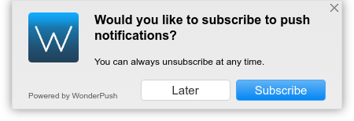

WonderPush Web SDK plugin to present the user an opt-in dialog before prompting her for push permission.

Here is a screenshot of the default dialog shown to the user if no option is given:

<center>

</center>

It appears centered on the top edge of the page and does not scroll with the page.
The actual icon that will be show is the one you configured in the WonderPush dashboard.

# How to use this plugin

## From the WonderPush dashboard

Log in to your [WonderPush dashboard](https://dashboard.wonderpush.com/) and head over to the _Settings / Configuration_ page in the left menu.
Select the _Website_ tab and use this plugin.

## From the initialization options of the SDK

Change your call to `WonderPush.init()` to include the following, merging existing keys as necessary:

```javascript
WonderPush.init({
  plugins: {
    "optin-dialog": {
      // Add any option to customize the plugin as desired
    },
  },
});
```

You can find the reference of the options in the {@link OptinDialog.Options} section of the reference.

# Reference

The available options are described in the {@link OptinDialog.Options} section of the reference.

The available API is described on the {@link OptinDialog} class.
